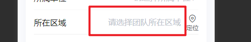
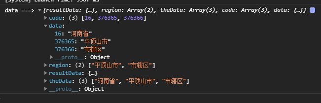

# 三级地址组件 《page-select-address》





> html

```html
	<page-select-address @address="onGetAddress" @close="close"
								:defaultAddress="theDefaultAddress">
                <u--input v-model="model.region" border="none" inputAlign="right"
                    placeholder="请选择团队所在区域" readonly></u--input>
</page-select-address>
```

> js

```js
//变量定义
theDefaultAddress:{}   
// 接口后赋值	
this.theDefaultAddress=[data.province_id, data.city_id, data.district_id]

onGetAddress(data) {
			console.log('data ===>', data);
			const { resultData, region } = data
			this.model = {
				...this.model,
				...resultData,
			}
			this.theAddressDate = resultData
			this.$set(this.model, 'region', region.join(''))
			this.spanStyle = 'overflow:auto'
		},
```
