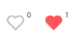
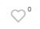

## 点赞  收藏 图标 形式


 

### 用于写页面

```vue
<page-icon type="collect"></page-icon>   
//type 取值
collect 收藏
vote 点赞
```

### 用于写逻辑

```vue
<page-icon :status="pageInfo.is_collect" type="collect" :count="pageInfo.collect_count" :theId="pageInfo.id" topic="moments" @refresh="getList"></page-icon>

  props: {
    /*ID */
    theId: {
      type: Number,
      default: 0
    },
    /*是否点赞 1是 2否*/
    status: {
      type: Number,
      default: 0
    },
    /*类型 参考README.md */
    topic: {
      type: String,
      default: 0
    },
    /** 不传不显示 传递则右上角显示角标 */
    count: {
      type: Number,
      default: null
    },
    /** collect | vote */
    type: {
      type: String,
      default: 'vote'
    }
  },


topic:{
    activity: "活动"
    activity_review: "活动回顾"
    article: "文章"
    comments: "评论"
    moments: "精彩瞬间"
    product: "产品"
    volunteer: "志愿者"
    volunteer_team: "志愿团队"
}


```

